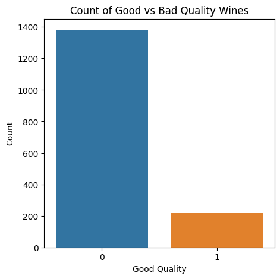
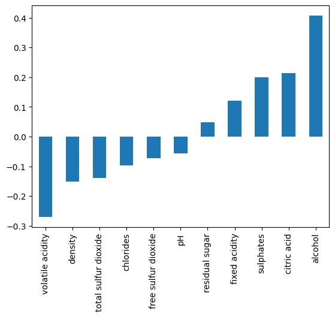
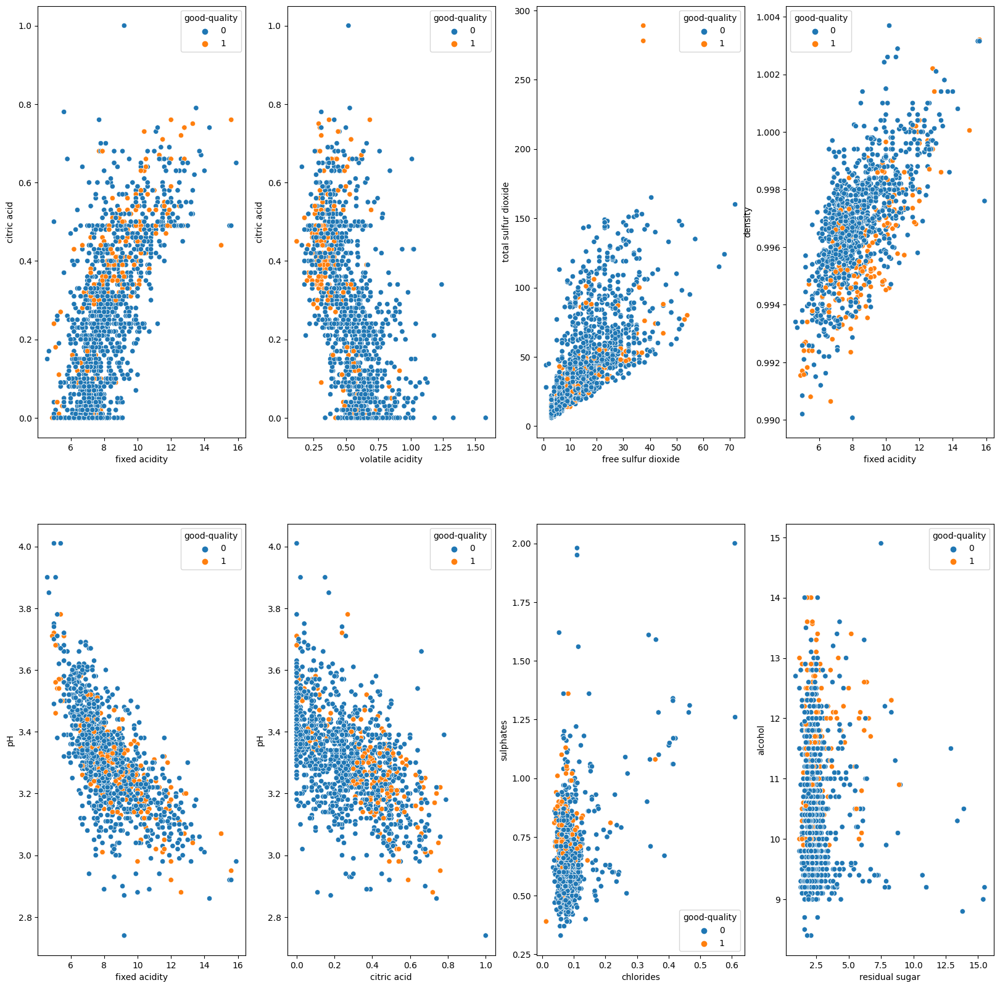
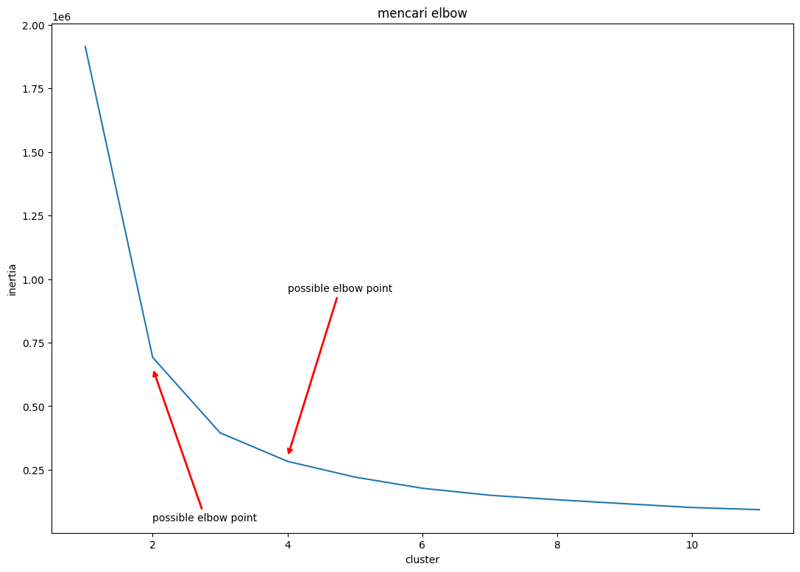
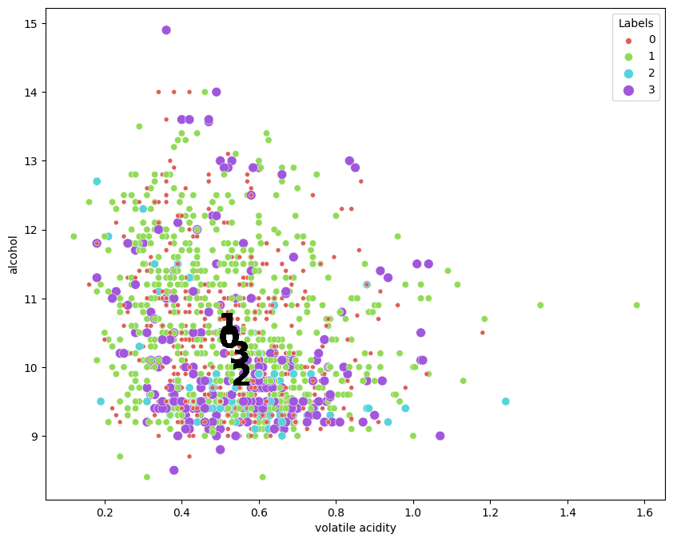
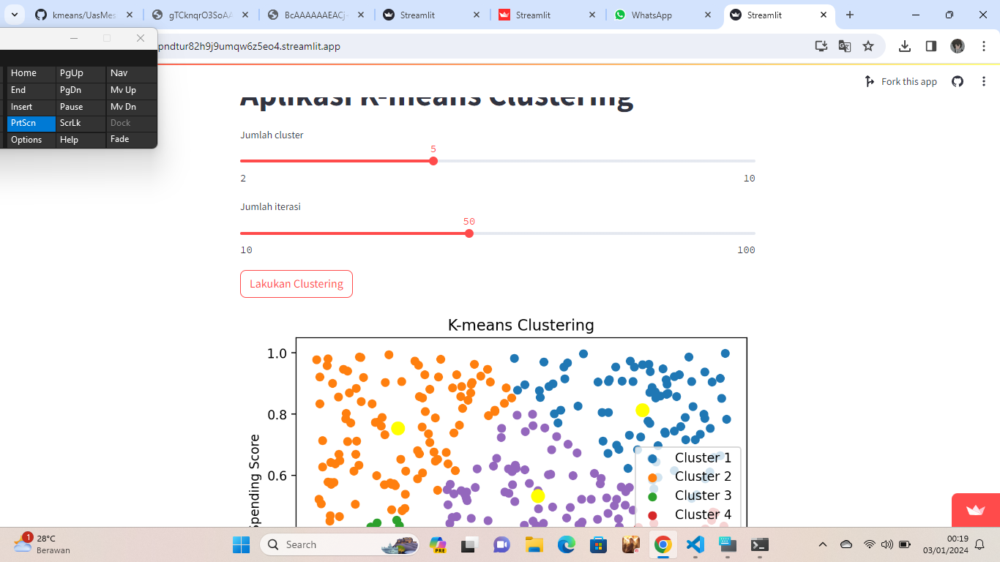
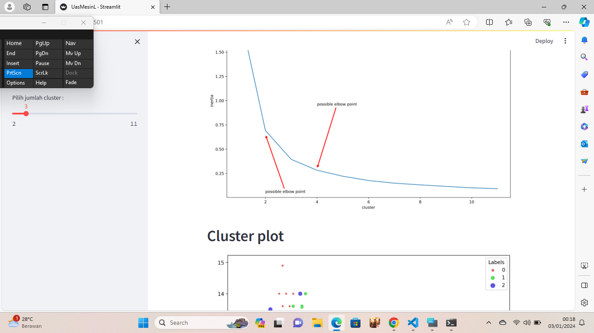
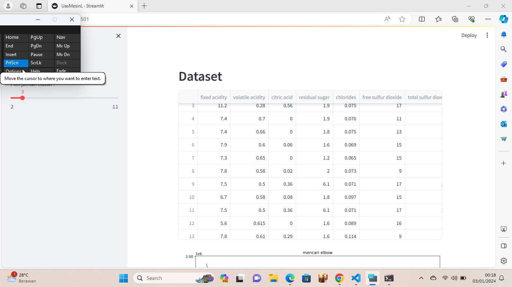

# Laporan Proyek Machine Learning

### Nama : Rifky Azhar Prayoga

### Nim : 211351124

### Kelas : IF Pagi A

## Domain Proyek
- Proyek ini bertujuan untuk mendalami dan mengungkapkan keindahan serta kompleksitas anggur merah. Dalam kerangka ini, proyek ini akan fokus pada pengembangan, penilaian, dan pemahaman mendalam terhadap berbagai jenis wine, membangun platform yang menyediakan informasi komprehensif serta pengalaman sensorial untuk para pecinta anggur.

## Business Understanding
- untuk menggali, memahami, dan memperkenalkan kompleksitas serta keindahan anggur merah kepada para pecinta anggur. Melalui platform digital, pendekatan sensorial, dan kolaborasi dengan pakar industri, WineCraft akan menciptakan suatu pengalaman yang mendalam dan bermakna di dalam dunia anggur.

### Problem Statements
- Kurangnya Informasi yang Mendalam
- Pemahaman yang Terbatas tentang Sensorial Wine
- Kurangnya Komunitas Pecinta Wine yang Terkoneksi
- Ketidakpastian dalam Pemilihan Wine
### Goals
- Memberikan pemahaman mendalam kepada pecinta anggur tentang berbagai jenis anggur merah, asal-usulnya, dan karakteristik rasa yang membedakan.
- Memberikan pelatihan sensorial yang lebih baik kepada staf industri anggur, termasuk sommelier dan pelayan, untuk meningkatkan layanan kepada pelanggan. 
- Menjadi sumber informasi terkemuka tentang anggur merah, menyajikan ulasan dan penilaian yang akurat dari para ahli dan pengguna.
- Mengintegrasikan teknologi baru untuk meningkatkan pengalaman 

### Solution statements
-   Menciptakan platform digital yang menyajikan informasi mendalam tentang anggur merah, mulai dari sejarah dan varietas hingga panduan pemilihan dan kombinasi makanan yang tepat.
-  Menyelenggarakan pelatihan sensorial berkala untuk staf industri anggur, termasuk sommelier dan pelayan, untuk meningkatkan pemahaman dan keterampilan mereka dalam melayani pelanggan.

## Data Understanding
-  Data ini menggunakan dataset yang berasal dari kaggle. Informasi anggur merah, profil aroma, rasa, dan tekstur, ulasan pengguna, data sensorial, informasi varietas dan asal-usul anggur. Menerapkan basis data yang terstruktur untuk menyimpan informasi dengan efisienu. Memastikan bahwa data yang digunakan sesuai dengan regulasi privasi data yang berlaku.

### Variabel-variabel pada Dataset Groceries adalah sebagai berikut:

- Fixed Acidity: Asam Tetap
- Volatile Acidity: Asam Volatil
- Citric Acid: Asam Sitrat
- Residual Sugar: Gula Sisa
- Chlorides: Klorida
- Free Sulfur Dioxide: Bebas Dioxide Belerang 
- Total Sulfur Dioxide: Total Dioxide Belerang
- Density: Kepadatan
- pH
- Sulphates: Sulfat
- Alcohol: Alkohol
- Good-Quality: Kualitas Baik

## Data Preparation
- Empty

### Data Collection
- Untuk data collection ini, saya menggunakan dataset Red Wine Quality. Dataset tersebut didapatkan dari website kaggle.
[Red Wine Quality)](https://www.kaggle.com/datasets/uciml/red-wine-quality-cortez-et-al-2009)

### Data Discovery And Profiling
- Disini saya menggunakan Metode Identification

# Import dataset kaggle

- Disini kita upload file kaggle.json kita yang di ambil dari kaggle (Creat token)

```bash
from google.colab import files
files.upload()
```

- Setelah upload akan keliatan file kaggle.json

```bash
!mkdir -p ~/.kaggle
!cp kaggle.json ~/.kaggle/
!chmod 600 ~/.kaggle/kaggle.json
!ls ~/.kaggle
```

- Disini kita download dataset terlebih dahulu atau menarik dataset dari kaggle

```bash
!kaggle datasets download -d uciml/red-wine-quality-cortez-et-al-2009
```

- Disini kita extract file dataset yang sudah kita download tadi

```bash
!unzip red-wine-quality-cortez-et-al-2009.zip -d redwine
!ls redwine
```

# Import library 
- Disini saya akan menginstall Library berikut karna dataset ini membutuhkan library yang saya cantumkan di bawah

```bash
import numpy as np
import pandas as pd
import matplotlib.pyplot as plt
import seaborn as sns
from sklearn.cluster import KMeans
from sklearn import preprocessing
from sklearn.preprocessing import LabelEncoder
from sklearn.preprocessing import StandardScaler
from sklearn.model_selection import train_test_split
from sklearn.metrics import accuracy_score
from sklearn.metrics import confusion_matrix
from sklearn.linear_model import LogisticRegression
from sklearn.tree import DecisionTreeClassifier
from sklearn import svm
from sklearn import metrics
```

# Data Discovery

- Disini kita akan menampilkan dataset yang tadi di download

```bash
df = pd.read_csv('/content/winequality.csv')
df.head()
```

- Menampilkan lengkap mengenai data frame

```bash
df.info()
```

- Menampilkan statistik deskriptif dari data frame

```bash
df.describe()
```
# EDA




- Menunjukan 10 produk paling laris

```bash
plt.figure(figsize=(5,5))
sns.countplot(x='good-quality', data=df)
plt.xlabel('Good Quality')
plt.ylabel('Count')
plt.title('Count of Good vs Bad Quality Wines')
plt.show()
```



- 10 Jenis barang yang di beli di tahun 2014

```bash
df.corr()['good-quality'][:-1].sort_values().plot(kind='bar')
```




```bash
fig, ax = plt.subplots(2,4,figsize=(20,20))
sns.scatterplot(x = 'fixed acidity', y = 'citric acid', hue = 'good-quality', data = df, ax=ax[0,0])
sns.scatterplot(x = 'volatile acidity', y = 'citric acid', hue = 'good-quality', data = df, ax=ax[0,1])
sns.scatterplot(x = 'free sulfur dioxide', y = 'total sulfur dioxide', hue = 'good-quality', data = df, ax=ax[0,2])
sns.scatterplot(x = 'fixed acidity', y = 'density', hue = 'good-quality', data = df, ax=ax[0,3])
sns.scatterplot(x = 'fixed acidity', y = 'pH', hue = 'good-quality', data = df, ax=ax[1,0])
sns.scatterplot(x = 'citric acid', y = 'pH', hue = 'good-quality', data = df, ax=ax[1,1])
sns.scatterplot(x = 'chlorides', y = 'sulphates', hue = 'good-quality', data = df, ax=ax[1,2])
sns.scatterplot(x = 'residual sugar', y = 'alcohol', hue = 'good-quality', data = df, ax=ax[1,3])
```

# Data Preparation

- Pada tahapan ini kita akan memastikan tipe data yang digunakan sesuai, tidak ada nilai kosong

- Cek type dari setiap kolom

```bash
print(df.info())
```
- Ubah nama kolom

```bash
df['quality'] = df['quality'].apply(lambda x: 1 if x >= 7 else 0)
df.rename(columns={'quality': 'good-quality'}, inplace=True)
df.head()
```

# Modelling

- Menentukan jumlah cluster yang optimal untuk membagi data anggur merah. Ini dapat dilakukan dengan menggunakan metode seperti Elbow Method,
  Menggunakan algoritma K-Means untuk membentuk cluster. Algoritma ini akan mempartisi data ke dalam sejumlah k kelompok berdasarkan atribut atau fitur yang dipilih.

- Elbow Method

 ```bash
cluster=[]
for i in range(1,12):
    km =KMeans(n_clusters=i).fit(df)
    cluster.append(km.inertia_)

fig, ax = plt.subplots(figsize=(13,9))
sns.lineplot(x=list(range(1,12)), y=cluster, ax=ax)
ax.set_title('mencari elbow')
ax.set_xlabel('cluster')
ax.set_ylabel('inertia')

ax.annotate('possible elbow point', xy=(2, 650000), xytext=(2, 50000),xycoords='data',
            arrowprops=dict(arrowstyle='->', connectionstyle='arc3', color='red', lw=2))

ax.annotate('possible elbow point', xy=(4, 300000), xytext=(4, 950000),xycoords='data',
            arrowprops=dict(arrowstyle='->', connectionstyle='arc3', color='red', lw=2))
        
```





# Visualisasi

- Scater plot

```bash
n_clust = 4
kmean = KMeans(n_clusters=n_clust).fit(X)
X['Labels'] = kmean.labels_
```

```bash

plt.figure(figsize=(10,8))
sns.scatterplot(x=X['volatile acidity'], y=X['alcohol'], hue=X['Labels'], markers=True, size=X['Labels'], palette=sns.color_palette('hls', n_clust))


for label in X['Labels']:
  plt.annotate(label,
               (X[X['Labels']==label]['volatile acidity'].mean(),
                X[X['Labels']==label]['alcohol'].mean()),
                horizontalalignment = 'center',
                verticalalignment = 'center',
                size = 27, weight='bold',
                color = 'black')
```




## Kesimpulan

- Data redwine telah dijelajahi dan dipahami dengan baik melalui aktivitas data discovery dan profiling. Ini melibatkan identifikasi variabel, pemahaman distribusi, dan penanganan nilai yang hilang.
- Melalui metode Elbow atau Silhouette, jumlah optimal cluster (k) telah ditentukan untuk membentuk partisi data yang menggambarkan struktur internal yang baik.
- Sebagai upaya untuk meningkatkan kualitas hasil clustering, model dapat dioptimalkan dengan menyesuaikan parameter atau mencoba nilai k yang berbeda.

## Saran

- Lakukan analisis data yang lebih mendalam untuk memahami karakteristik dan distribusi variabel. Identifikasi pola unik atau tren yang dapat memberikan wawasan tambahan terkait kualitas anggur merah.
- Pilih dengan hati-hati variabel yang akan dimasukkan dalam model. Gunakan wawasan dari analisis data untuk menentukan fitur yang paling relevan dalam memprediksi kualitas anggur.
- ika terdapat ketidakseimbangan dalam kelas kualitas anggur, pertimbangkan teknik penanganan ketidakseimbangan seperti oversampling atau undersampling untuk memperbaiki distribusi kelas.

# Streamlit App

[Red Wine Quality](https://k-means-pndtur82h9j9umqw6z5eo4.streamlit.app/)




